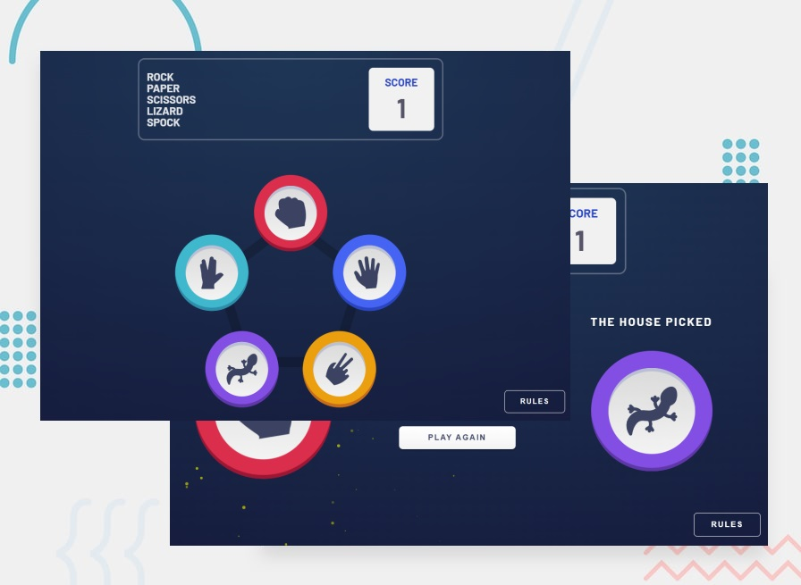

# Frontend Mentor - Rock, Paper, Scissors solution

This is a solution to the [Rock, Paper, Scissors challenge on Frontend Mentor](https://www.frontendmentor.io/challenges/rock-paper-scissors-game-pTgwgvgH).

## Table of contents

- [The challenge](#the-challenge)
- [Screenshot](#screenshot)
- [Links](#links)
- [Built with](#built-with)
- [Author](#author)

### The challenge

Users should be able to:

- View the optimal layout for the game depending on their device's screen size
- Play Rock, Paper, Scissors, Lizard, Spock against the computer

### Screenshot

### Live preview

- [Live preview](https://rock-paper-scissors-lizard-spock-gamma.vercel.app/)

### Built with

- [React](https://reactjs.org/)
- [Vite](https://vitejs.dev/)
- SCSS (styling and animations)
- some trigonometry
- canvas for particles

### Author

- Linkedin - [Donato Di Zenzo](https://www.linkedin.com/in/donato-di-zenzo/)
- Frontend Mentor - [@dodiz](https://www.frontendmentor.io/profile/dodiz)
